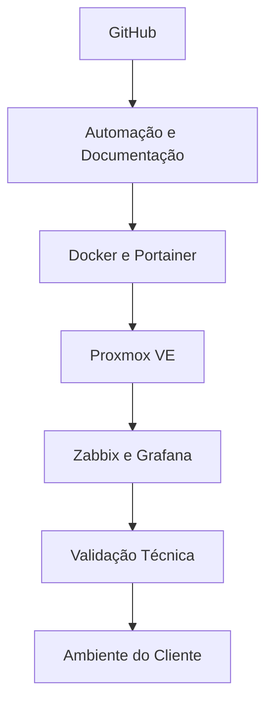

  

<h1 align="center">Intelpar Tecnologia</h1>

  <strong>Tecnologia sob controle. Sempre.</strong>

  Infraestrutura de TI • Segurança Gerenciada • Microsoft 365 • Backup Corporativo • Monitoramento 24x7

  
  
  
  
  

---

## Quem somos

A **Intelpar Tecnologia** desenvolve soluções corporativas de infraestrutura de TI, segurança da informação, continuidade operacional e governança tecnológica.

Nosso objetivo é transformar a tecnologia em um ativo estratégico, entregando ambientes previsíveis, seguros e continuamente monitorados para empresas que **não podem parar**.

---

## 🚀 Especialidades

| Área | Atuação |
|---|---|
| ☁️ Microsoft 365 | Produtividade, colaboração, e-mail corporativo e segurança |
| 🛡️ Segurança Gerenciada | Proteção contínua, antivírus corporativo, MFA e boas práticas |
| 💾 Backup Corporativo | Proteção de dados, recuperação e continuidade operacional |
| 📊 Monitoramento 24x7 | Zabbix, alertas, dashboards e visibilidade da infraestrutura |
| 🌐 Infraestrutura de Redes | Redes corporativas, servidores, firewall, VPN e Wi-Fi empresarial |
| 🖥️ Virtualização | Proxmox VE, Hyper-V e ambientes escaláveis |
| 🐳 Containers | Docker, Portainer e aplicações modernas |
| ⚙️ Automação | PowerShell, scripts, padronização e implantação |
| 🔐 Governança e LGPD | Documentação, políticas, controles e conformidade |

---

## 🧪 IntelLab

A Intelpar mantém um ambiente próprio para testes, homologação e validação de soluções antes da aplicação em ambientes de clientes.

### Tecnologias utilizadas no laboratório

- Proxmox VE
- Debian Linux
- Docker
- Portainer
- PostgreSQL
- Nginx
- Zabbix
- Grafana
- Uptime Kuma
- Microsoft 365
- Bitdefender
- Action1
- GitHub

---

## 📦 Projetos Intelpar

| Projeto | Status | Descrição |
|---|:---:|---|
| **IntelCare** | 🚧 | Plataforma para gestão de clínicas, nutricionistas e atendimento digital |
| **IntelQuality** | 🚧 | Sistema de Gestão da Qualidade, POPs, revisões e documentos |
| **IntelDeploy** | 🚧 | Automação de implantações, padronizações e provisionamento |
| **IntelScripts** | 🚧 | Biblioteca de scripts PowerShell, Windows, Microsoft 365 e infraestrutura |
| **IntelDocs** | 🚧 | Documentação técnica, guias, checklists e base de conhecimento |
| **IntelNOC** | 🚧 | Monitoramento, dashboards, alertas e indicadores operacionais |
| **IntelBackup** | 🔄 | Estratégias, documentação e automações para continuidade operacional |

---

## 🛣️ Roadmap

| Status | Entrega |
|:---:|---|
| ✅ | Organização GitHub criada |
| ✅ | Identidade institucional aplicada |
| ✅ | Perfil público da organização |
| ✅ | IntelLab definido |
| 🚧 | Repositórios oficiais |
| 🚧 | IntelCare |
| 🚧 | IntelQuality |
| 🚧 | IntelDeploy |
| 🚧 | IntelDocs |
| 🚧 | IntelNOC |
| ⏳ | Portal Open Source |
| ⏳ | Brand Kit Intelpar |
| ⏳ | Design System Intelpar |

---

## 💻 Stack Técnica

  
  
  
  
  
  
  
  
  
  
  
  

---

## 📊 Indicadores

| Indicador | Valor |
|---|---|
| Monitoramento | 24x7 |
| Foco | Empresas |
| Modelo | Serviços Gerenciados de TI |
| Base técnica | Infraestrutura, Segurança, Backup e Microsoft 365 |
| Localização | Paranaguá • Paraná • Brasil |

---

## 🌎 Conecte-se

| Canal | Link |
|---|---|
| 🌐 Website | https://intelpar.com.br |
| 💼 LinkedIn | https://linkedin.com/company/intelpar |
| 📷 Instagram | https://instagram.com/intelparbr |
| 📘 Facebook | https://facebook.com/intelparbr |
| ▶️ YouTube | https://youtube.com/@intelpartecnologia |
| 📧 E-mail | contato@intelpar.com.br |

---

## 💡 Nossa filosofia

> Empresas não compram computadores.  
> Compram disponibilidade.  
> Compram segurança.  
> Compram continuidade.  
>
> **Nós entregamos tecnologia sob controle. Sempre.**

---

  <strong>Intelpar Tecnologia</strong> 
  Infraestrutura • Segurança • Continuidade Operacional 
  <strong>Tecnologia sob controle. Sempre.</strong>

