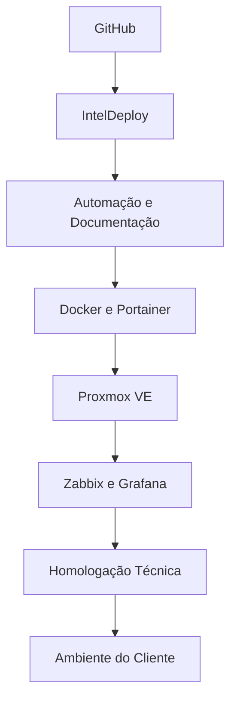
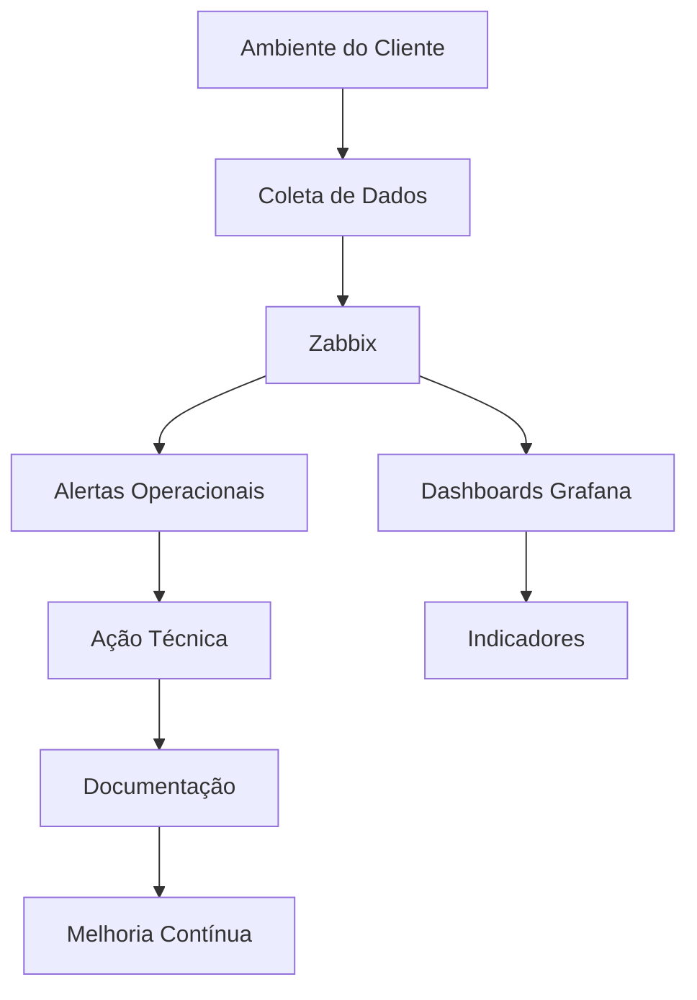
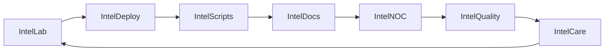

<!--
  Intelpar GitHub Enterprise Kit
  README v3.0 Premium
  Arquivo principal para: .github/profile/README.md

  Componentes reutilizáveis disponíveis em:
  .github/profile/components/

  Assets disponíveis em:
  .github/profile/assets/
-->

  <picture>
    <source media="(prefers-color-scheme: dark)" srcset="assets/hero-dark.webp">
    <source media="(prefers-color-scheme: light)" srcset="assets/hero-light.webp">
    
  </picture>

<h1 align="center">Intelpar Tecnologia</h1>

  <strong>Tecnologia sob controle. Sempre.</strong> 
  Infraestrutura de TI • Cibersegurança • Microsoft 365 • Backup Corporativo • Monitoramento 24x7

  
  
  
  
  
  

  

## Quem somos

A **Intelpar Tecnologia** desenvolve soluções corporativas de infraestrutura de TI, segurança da informação, continuidade operacional e governança tecnológica.

Nosso objetivo é transformar tecnologia em um ativo estratégico: ambientes previsíveis, seguros, documentados e continuamente monitorados para empresas que **não podem parar**.

> Empresas não compram computadores.  
> Compram disponibilidade.  
> Compram segurança.  
> Compram continuidade.  
>
> **Nós entregamos tecnologia sob controle. Sempre.**

---

## Pilares de atuação

| 🛡️ Segurança Gerenciada | ☁️ Cloud e colaboração |
|---|---|
| Bitdefender, Microsoft Defender, MFA, políticas, hardening e boas práticas. | Microsoft 365, Google Workspace, Zoho, e-mail corporativo, colaboração e produtividade. |

| 📊 Monitoramento 24x7 | ⚙️ Automação e padronização |
|---|---|
| Zabbix, Grafana, Uptime Kuma, dashboards, alertas e indicadores. | PowerShell, Action1, GitHub Actions, scripts e implantação padronizada. |

| 💾 Continuidade Operacional | 🌐 Infraestrutura corporativa |
|---|---|
| Backup corporativo, testes de restauração, disaster recovery e documentação. | Servidores, redes, firewall, VPN, Wi-Fi corporativo, virtualização e containers. |

---

## IntelLab

A Intelpar mantém um ambiente próprio para testes, homologação e validação de soluções antes da aplicação em ambientes de clientes.

### Base técnica do IntelLab

| Categoria | Tecnologias |
|---|---|
| Virtualização | Proxmox VE, Hyper-V |
| Linux | Debian, Ubuntu |
| Containers | Docker, Portainer |
| Monitoramento | Zabbix, Grafana, Uptime Kuma |
| Banco de dados | PostgreSQL, MariaDB, MySQL |
| Web stack | Nginx, PHP, WordPress |
| Segurança | Bitdefender, Microsoft Defender, MFA |
| Automação | PowerShell, Action1, GitHub Actions |
| Cloud e colaboração | Microsoft 365, Google Workspace, Zoho |

---

## IntelNOC

O **IntelNOC** representa a visão operacional da Intelpar: monitoramento, alertas, indicadores, inventário e melhoria contínua.

| Camada | Objetivo |
|---|---|
| Disponibilidade | Identificar falhas antes de impactarem o negócio |
| Indicadores | Transformar eventos técnicos em informação gerencial |
| Alertas | Reduzir o tempo de resposta e padronizar ações |
| Documentação | Registrar histórico, procedimentos e evolução |
| Governança | Melhorar processos e reduzir riscos operacionais |

---

## Ecossistema Intelpar

A Intelpar está desenvolvendo um conjunto de soluções próprias para organizar conhecimento técnico, operação, documentação e relacionamento com clientes.

| Projeto | Status | Objetivo |
|---|:---:|---|
| **IntelCare** | 🚧 | Plataforma para gestão de clínicas, nutricionistas e atendimento digital |
| **IntelQuality** | 🚧 | Sistema de Gestão da Qualidade, POPs, revisões e documentos |
| **IntelDeploy** | 🚧 | Automação de implantações, padronizações e provisionamento |
| **IntelScripts** | 🚧 | Biblioteca de scripts PowerShell, Windows, Microsoft 365 e infraestrutura |
| **IntelDocs** | 🚧 | Documentação técnica, guias, checklists e base de conhecimento |
| **IntelNOC** | 🚧 | Monitoramento, dashboards, alertas e indicadores operacionais |
| **IntelBackup** | 🔄 | Estratégias, documentação e automações para continuidade operacional |
| **IntelLGPD** | ⏳ | Modelos, políticas e documentação para governança e privacidade |

---

## Stack técnica

### Plataformas principais

  
  
  
  
  
  
  

### Ecossistema técnico

| Categoria | Tecnologias |
|---|---|
| Cloud e colaboração | Microsoft 365, Google Workspace, Zoho |
| Segurança e governança | Bitdefender, Microsoft Defender, MFA, LGPD |
| Monitoramento e operação | Zabbix, Grafana, Uptime Kuma |
| Infraestrutura | Windows Server, Debian, Ubuntu, Proxmox VE, Hyper-V |
| Containers | Docker, Portainer |
| Automação | PowerShell, Action1, GitHub Actions |
| Dados e web | PostgreSQL, MariaDB, MySQL, Nginx, WordPress |

---

## Segmentos atendidos

| Segmento | Necessidade comum |
|---|---|
| 🏫 Educação | Microsoft 365, disponibilidade, segurança e governança |
| 🚢 Logística | Continuidade operacional, rede, servidores e monitoramento |
| 🛒 Comércio | Caixa, ERP, backup, suporte e produtividade |
| 🏢 Serviços profissionais | E-mail corporativo, colaboração, segurança e documentação |
| 🏥 Saúde e clínicas | Privacidade, atendimento digital, backup e rastreabilidade |
| 🏭 Operações críticas | Infraestrutura previsível, indicadores e resposta rápida |

---

## Roadmap

| Status | Entrega |
|:---:|---|
| ✅ | Organização GitHub criada |
| ✅ | Identidade institucional aplicada |
| ✅ | Perfil público da organização |
| ✅ | IntelLab definido |
| ✅ | IntelNOC conceitual |
| 🚧 | Repositórios oficiais |
| 🚧 | IntelCare |
| 🚧 | IntelQuality |
| 🚧 | IntelDeploy |
| 🚧 | IntelDocs |
| 🚧 | IntelNOC |
| ⏳ | Portal Open Source |
| ⏳ | Brand Kit Intelpar |
| ⏳ | Design System Intelpar |
| ⏳ | GitHub Pages / IntelDocs público |

---

## Indicadores

| Indicador | Valor |
|---|---|
| Monitoramento | 24x7 |
| Foco | Empresas |
| Modelo | Serviços Gerenciados de TI |
| Base técnica | Infraestrutura, Segurança, Backup e Microsoft 365 |
| Localização | Paranaguá • Paraná • Brasil |
| Princípio operacional | Documentar, monitorar, automatizar e melhorar |

---

## Parceiros e ecossistema

| Área | Ecossistema |
|---|---|
| Cloud e produtividade | Microsoft 365, Google Workspace, Zoho |
| Segurança | Bitdefender, Microsoft Defender |
| Patching e automação | Action1, PowerShell, GitHub Actions |
| Infraestrutura | Proxmox VE, Docker, Debian, Windows Server |
| Monitoramento | Zabbix, Grafana, Uptime Kuma |
| Distribuição e canais | TD SYNNEX, parceiros e fornecedores especializados |

---

## Conecte-se

| Canal | Acesso |
|-------|--------|
| 🌐 Website | **[intelpar.com.br](https://intelpar.com.br)** |
| 💼 LinkedIn | **[@intelpar](https://linkedin.com/company/intelpar)** |
| 📷 Instagram | **[@intelpar](https://instagram.com/intelpar)** |
| 📘 Facebook | **[/intelparbr](https://facebook.com/intelparbr)** |
| ▶️ YouTube | **[@intelpartecnologia](https://youtube.com/@intelpartecnologia)** |
| 📧 E-mail | **contato@intelpar.com.br** |

---

  

  <strong>INTELPAR TECNOLOGIA</strong> 
  Infraestrutura • Segurança • Continuidade Operacional 
  Paranaguá • Paraná • Brasil 
  <strong>Tecnologia sob controle. Sempre.</strong>

